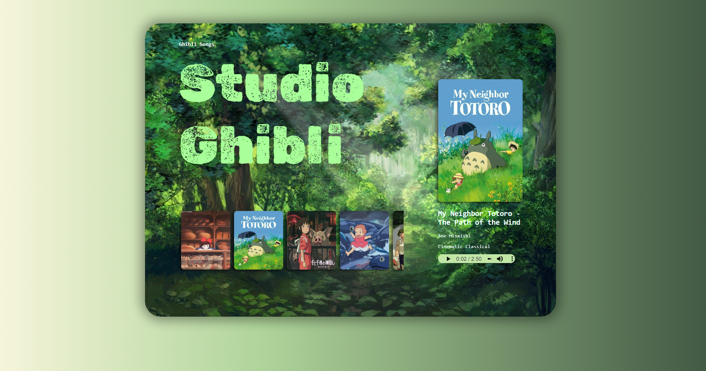
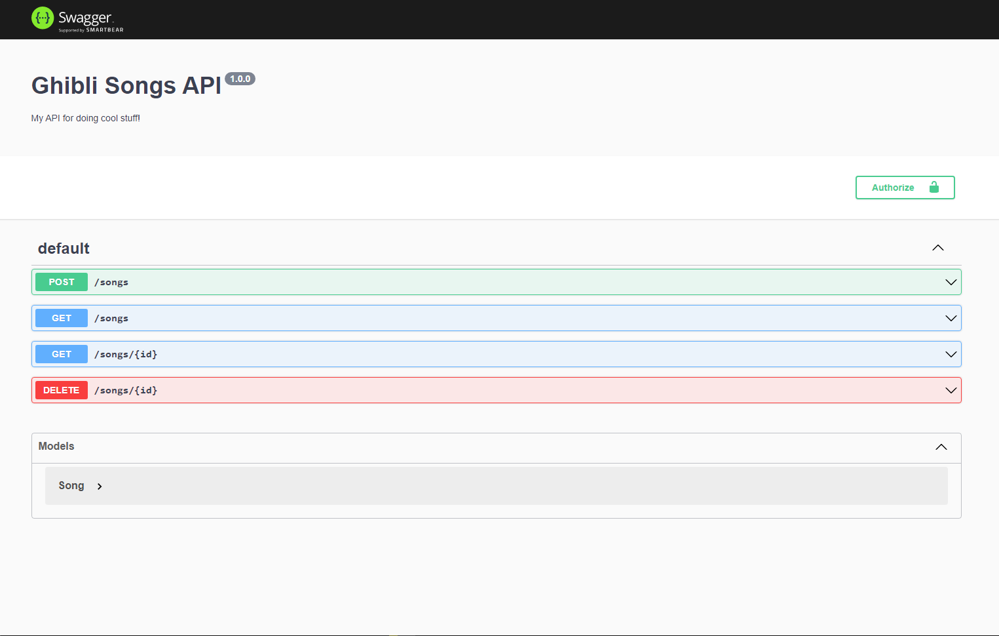

# ghibli-songs-api

Web App

REST API

## Usage

* Visit [ghibli-songs-api](https://stefanygonzalezleon.github.io/ghibli-songs-api/)
* Play a song.

## Features

* React client.
* Node.js server.
* MongoDB storage.

## Author

- [@stefanygonzalezleon](https://www.github.com/stefanygonzalezleon)